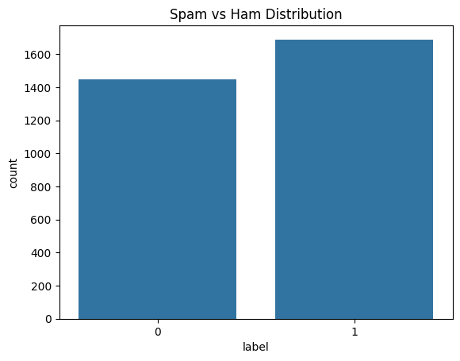
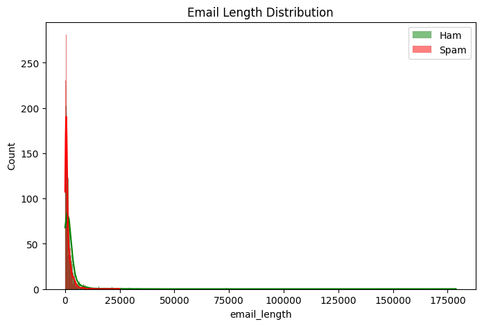

# Spam Email Classifier using Machine Learning

A complete end-to-end machine learning project that classifies emails as **Spam** or **Ham (Not Spam)** using Natural Language Processing (NLP) techniques and supervised learning models.

This project covers **data analysis, text preprocessing, feature extraction, model training, evaluation, and real-world testing**, making it suitable for resume and interview discussions.

---

##  Project Overview

Email spam is a major problem in modern communication systems.  
This project builds a spam detection system that automatically identifies unwanted emails using machine learning algorithms.

---

##  Problem Statement

Given the content of an email, classify it as:
- **Spam (1)** → Promotional, fraudulent, or unwanted emails  
- **Ham (0)** → Legitimate and genuine emails  

---

##  Dataset

- Source: Public email dataset (CSV)
- Columns:
  - `label`: Target variable (0 = Ham, 1 = Spam)
  - `text`: Email content

---

##  Technologies Used

- Python
- Pandas, NumPy
- Matplotlib, Seaborn
- Scikit-learn
- NLP (TF-IDF Vectorization)

---

##  Exploratory Data Analysis (EDA)

- Analyzed class distribution (Spam vs Ham)
- Studied email length patterns
- Visualized data distributions to understand spam behavior

Sample Visualizations:

---

##  Text Preprocessing

- Lowercasing
- Removing punctuation and numbers
- Removing extra whitespaces
- Stopword removal using TF-IDF

---

## Feature Engineering

- Used **TF-IDF Vectorizer**
- Limited features to top 5000 terms
- Converted text data into numerical form

---

## Models Implemented

| Model | Purpose |
|-----|-------|
| Naive Bayes | Baseline model for text classification |
| Logistic Regression | Final selected model |

---

## Model Evaluation

- Accuracy
- Precision
- Recall
- F1-Score
- Confusion Matrix

Confusion Matrix:

---

## Model Testing

The trained model was tested using:
- Custom user-input emails
- Batch email testing
- Edge cases (empty and mixed content)

 Sample Prediction:

---

## Final Result

- Logistic Regression achieved better Recall and F1-score
- Model effectively identifies spam emails
- Low false-negative rate (important for spam detection)

---

## Saved Artifacts

- `spam_classifier.pkl` → Trained ML model
- `tfidf_vectorizer.pkl` → TF-IDF feature extractor

---

##How to Run the Project

1. Clone the repository
2. Open `Spam_Email_Classifier.ipynb`
3. Run all cells in order
4. Test the model using custom email inputs

---

## Future Improvements

- Add lemmatization and stemming
- Try deep learning models (LSTM)
- Deploy using Streamlit or Flask

---

##  Author

**Your Name**  
B.Tech Student | Aspiring Data Scientist  
